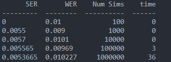
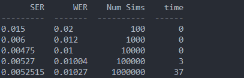
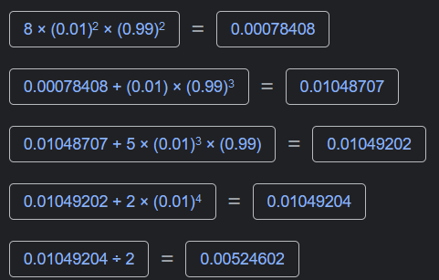

# Channel Encoding Simulator

## Introduction

This is a simple channel encoding simulator. It is written in Python 3.8. The program simulates the transmission of a message through a channel with a given probability. The message is encoded using Parity Check Error Correcting Code with Generator Matrix, G, H, size of source encoded message, k and encoded message size, n hardcoded. The standard array is also hardcoded which can be changed in the code. 

G = [[1, 0], [0, 1], [1, 0], [1, 1]]

H = [[1, 0, 1, 0], [1, 1, 0, 1]]

k = 2

n = 4

## How to run
Create a virtual environment:

``` python -m venv env ```

Activate the virtual environment:

``` env\Scripts\activate ```

Install the requirements:

``` pip install -r requirements.txt ```

Run the program:

``` python main.py ```

uncomment the line ``` channel.test()``` to run the tests


## Results
<!-- images/result-1.png -->




SER is close to the calculated value of 0.00524602


